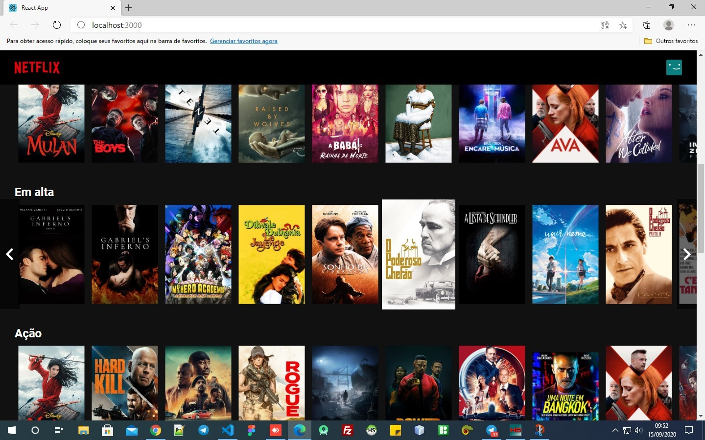

# Clone NetFlix
> Projeto criado em base de estudo de uma aula do Bonieky Lacerda, link abaixo. 
> https://www.youtube.com/watch?reload=9&v=tBweoUiMsDg&t=3673s

#### Projeto usando api do Themoviedb.org para pegar as imagens do projeto, material-ui para pegar alguns icones, ReactJs, JavaScript.

## Imagens do projeto

### Tamanho web

### Tamanho Tablet

## Como usar:
1. Abra o projeto 
2. Use: "npm install" para baixar os node_modules
3. Depois use: "npm start" 
4. Vai abrir em: http://localhost:3000/

## Conteudo desse estudo
* Html
* Css
* JavaScript
* Api
* função condicional
* Efeito esfumaçado na serie em destaque
* Scroll das listas de filmes de forma dinamica
* Header com efeito no scroll da página
* Hooks

